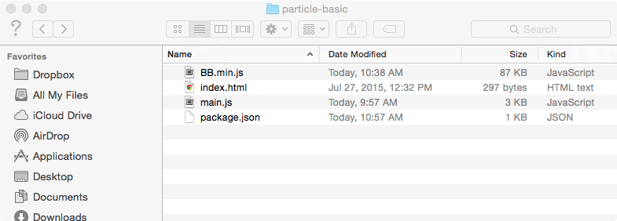
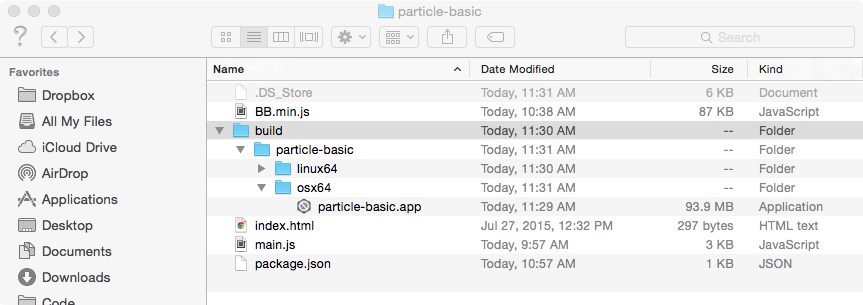

# Building Node Webkit Apps Fabian

[NW-Builder](https://github.com/nwjs/nw-builder) makes building apps from HTML5/CSS/JavaScript with NW.js easy. NW-Builder will automatically download the latest version (or a specified version specified by your `package.json`) of [NW.js](http://nwjs.io) for each target platform. With NW-Builder you can create apps for targets/platforms other than the one you are actually building from.

First, make sure that `nwbuild` is installed globally by NPM:

```
npm install -g nw-builder
```

Below is the `nwbuild` usage:

```
Usage: nwbuild [options] [path]

Options:
  -p, --platforms      Platforms to build, comma-sperated, can be: win32,win64,osx32,osx64,linux32,linux64  [default: "osx32,osx64,win32,win64"]
  -v, --version        The nw version, eg. 0.8.4                                                            [default: "latest"]
  -r, --run            Runs NW.js for the current platform                                                  [default: false]
  -o, --buildDir       The build folder                                                                     [default: "./build"]
  -f, --forceDownload  Force download of NW.js                                                              [default: false]
  --quiet              Disables logging                                                                     [default: false]
```

To build a project, first make sure that you have a valid `package.json` file in your root folder that describes your app. This file can also (and probably should) include [NW manifest format](https://github.com/nwjs/nw.js/wiki/Manifest-format) properties to configure the application.

## Example



To build this example project for 64-bit linux and OSX:

```
nwbuild --platforms "linux64,osx64" path/to/src
```

The default output creates a folder called `build/` inside of the directory `nwbuild` ran from.

